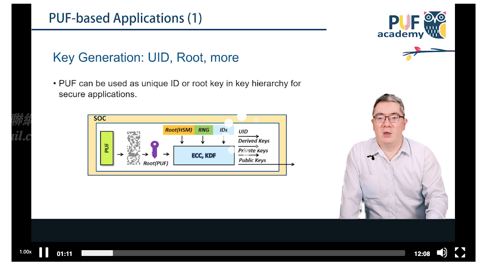
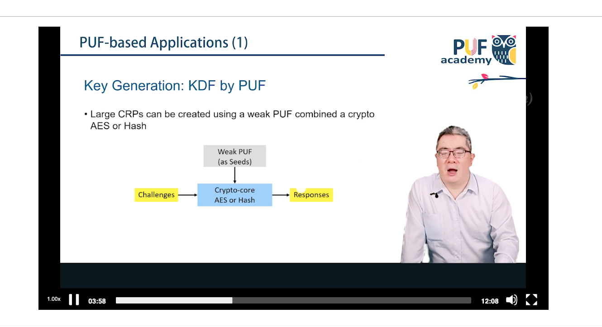
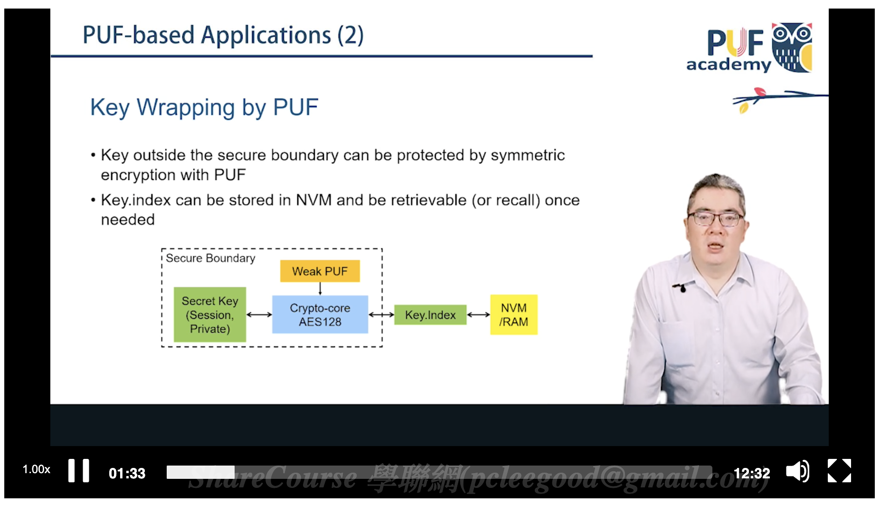
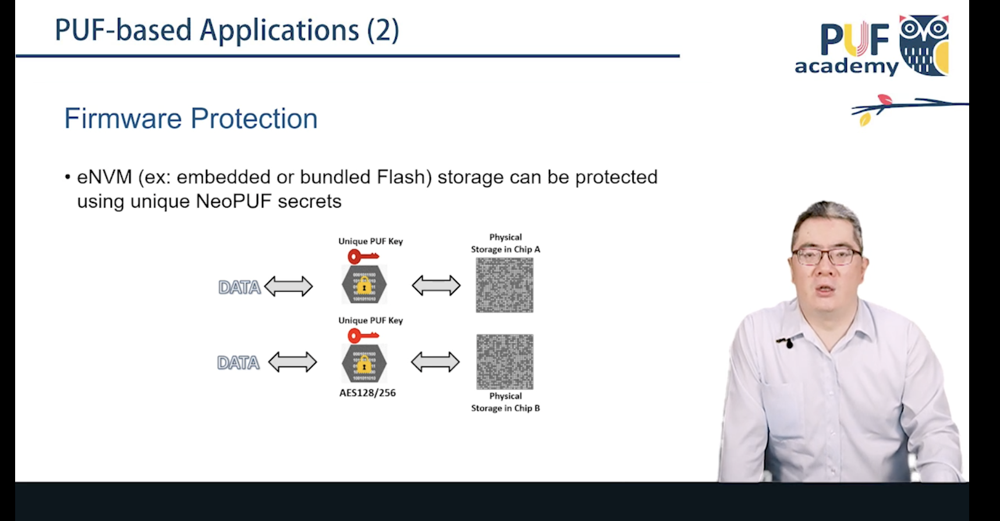
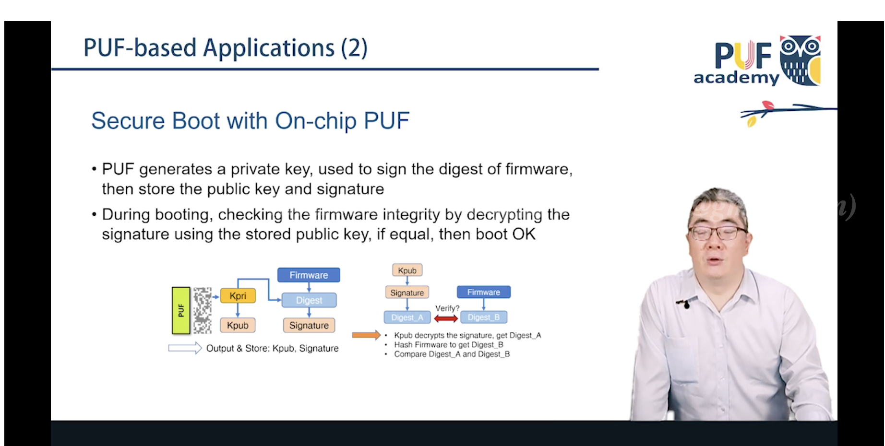
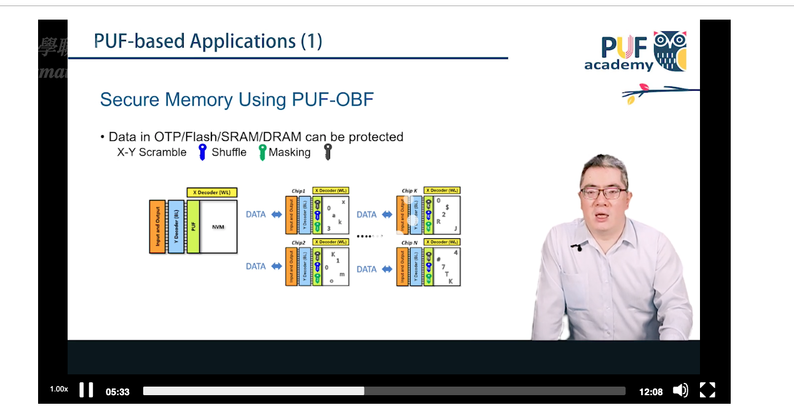

# Module 26: PUF-based Applications (基於 PUF 的安全應用) — Theory

## 1. From Physical Fingerprint to Security Service

A raw PUF response is just a noisy random-looking bit string. Turning that physical characteristic into concrete security services centers on two foundational pillars: **keyless storage** and **device identification/authentication** — and extends into TRNG entropy, firmware/IP protection, key derivation, and zero-touch provisioning.

## 2. Application 1: Cryptographic Key Generation & Keyless Storage

This is the most fundamental PUF application in modern SoCs: replacing non-volatile memory (eFuse, EEPROM) as the place a root key is "stored."

- **Keyless storage advantage**: in a traditional architecture the key sits as static data-at-rest in memory, vulnerable to physical probing, delayering/reverse-engineering, or cold-boot attacks. A PUF instead has **no key present while powered off** — the key is measured/generated on-the-fly only when the system is powered and a specific request is made. After power-down, the key reverts to an invisible physical microstructure.
- **Fuzzy extractor's role**: since most PUFs (e.g. SRAM PUF) exhibit a nonzero bit error rate (BER) across environments, a fuzzy extractor is required to derive a $100\%$-stable symmetric key (e.g. AES-256):
  1. **Enrollment**: read raw response $R$, compute helper data $W$, publicly store $W$; generate key $K$.
  2. **Reproduction**: re-power, get noisy response $R'$; use public $W$ + ECC to compute $K = \text{Reproduce}(R', W)$, perfectly recovering $K$. $W$ leaks no information about $K$, so its exposure is not a security failure.

## 3. Application 2: IC Anti-Counterfeiting

The global semiconductor supply chain faces serious counterfeiting and overproduction threats — a malicious foundry may overproduce chips into the gray market, or "remark" recycled chips as new higher-spec parts.

- **PUF-based anti-counterfeiting**: since a PUF depends on natural process variation, *even the manufacturer cannot produce two chips with identical PUF output*. Before shipping, test equipment reads each chip's PUF response and registers it in a secure factory database.
- **Use case**: when an integrator or end user acquires a chip, they read its PUF fingerprint and compare it against the factory database. Unauthorized/counterfeit units cannot match, solving hardware supply-chain traceability and anti-counterfeiting at the root.

## 4. Application 3: Lightweight Device Authentication

IoT edge devices often lack the compute budget for RSA/ECC-based authentication.

**Challenge-response protocol** using a **strong PUF** (large CRP space, e.g. arbiter PUF):
1. Server picks an unused challenge $C$ from its database and sends it to the device.
2. Device feeds $C$ into its hardware PUF, produces response $R$, returns it.
3. Server checks $R$ against its database; the used $(C, R)$ pair is retired to prevent replay attacks.

No heavy cryptography is required — dramatically reducing IoT power/hardware cost.

## 5. Application 4: TRNG High-Entropy Source

Beyond stable key generation, the *unstable* bits of a PUF (thermal noise, metastable SRAM cells at power-up, RO phase jitter) are themselves valuable: they can seed a **True Random Number Generator (TRNG)** for TLS nonces, session keys, etc. Modern hardware security IPs often combine a PUF's stable output (key generation) and unstable output (feeding a DRBG) in a single IP block, saving area and power.

## 6. Application 5: Hardware-Software Binding & IP Protection

Firmware and AI models are often a company's core IP. Without hardware protection, an attacker can clone firmware wholesale onto unauthorized devices.

- **PUF key wrapping**: firmware is encrypted (e.g. AES-GCM) before being written to external flash; the decryption key is generated dynamically by the device's internal PUF rather than hard-coded.
- **Absolute hardware binding**: because every chip's PUF differs, copying encrypted firmware to another device means that device's PUF cannot produce the correct decryption key — firmware refuses to boot. This achieves a strong binding between firmware and a specific physical chip, eliminating cloning/overproduction threats.

## 7. Application 6: Key Derivation & Multi-level Isolation

A complex SoC needs multiple keys for different purposes (disk encryption, session keys, MAC signing). Exposing the PUF root key directly to every application is a large attack surface.

- **KDF**: the PUF is structured as a **Hardware Unique Key (HUK)**, never directly exposed to software. The system combines the HUK with a context/App ID and feeds it into a hardware KDF (e.g. HMAC-KDF per NIST SP 800-108).
- **Isolation**: each application or virtual environment (e.g. ARM TrustZone Secure World vs. Normal World) receives only its derived sub-key. Compromise of one sub-key does not endanger the HUK or other applications.

## 8. Application 7: Zero-Touch Cloud Onboarding

Manually injecting credentials into every IoT device before cloud registration (AWS IoT Core, Azure IoT Hub) doesn't scale.

- **PUF-based PKI integration**: at manufacturing time, the chip uses its PUF to generate a public/private keypair. The public key is signed by a CA into an X.509 device certificate; the private key is dynamically regenerated by the PUF and never leaves the hardware boundary.
- **Automated trust establishment**: on first network connection, the cloud verifies the device's X.509 certificate — establishing physical identity and factory-authorized status, fully automating onboarding with hardware-level assurance.

## 9. Secure Memory (PUF-OBF)

Beyond key generation, a PUF can drive **memory obfuscation**: PUF-seeded X-Y address scrambling, cell-level shuffling, and masking randomize the physical mapping of logical data in OTP/Flash/SRAM/DRAM per chip, so that even physical extraction of raw memory contents from one chip does not reveal the layout used by any other chip.

## 10. References

1. Dodis, Y., Reyzin, L., & Smith, A. (2004). *Fuzzy extractors: How to generate strong keys from biometrics and other noisy data*. EUROCRYPT.
2. Ruhrmair, U., et al. (2010). *Modeling attacks on physical unclonable functions*. ACM CCS.
3. IEEE 802.1AR — *Secure Device Identity*.
4. NIST SP 800-108 — *Recommendation for Key Derivation Using Pseudorandom Functions*.
5. Maes, R. (2013). *Physically Unclonable Functions: Constructions, Properties and Applications*. Springer.
6. FIDO Alliance — *FIDO Device Onboard (FDO) Specification*.
